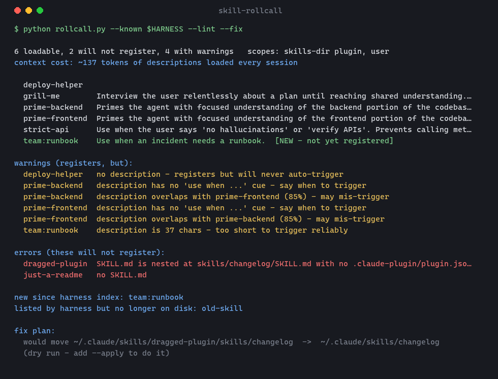
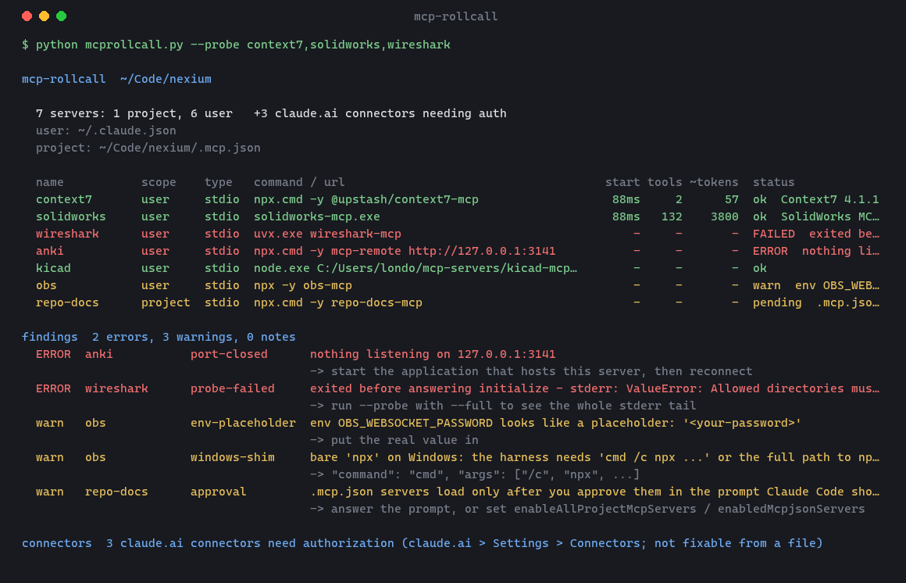
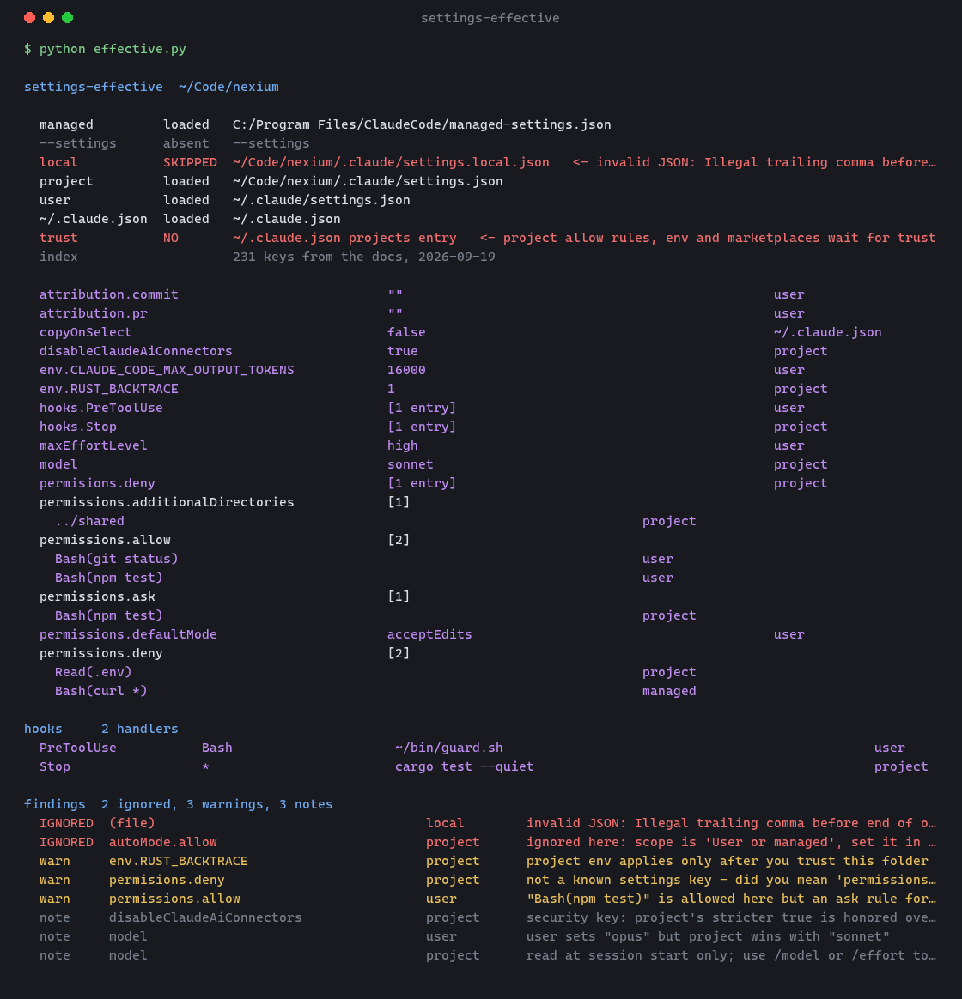
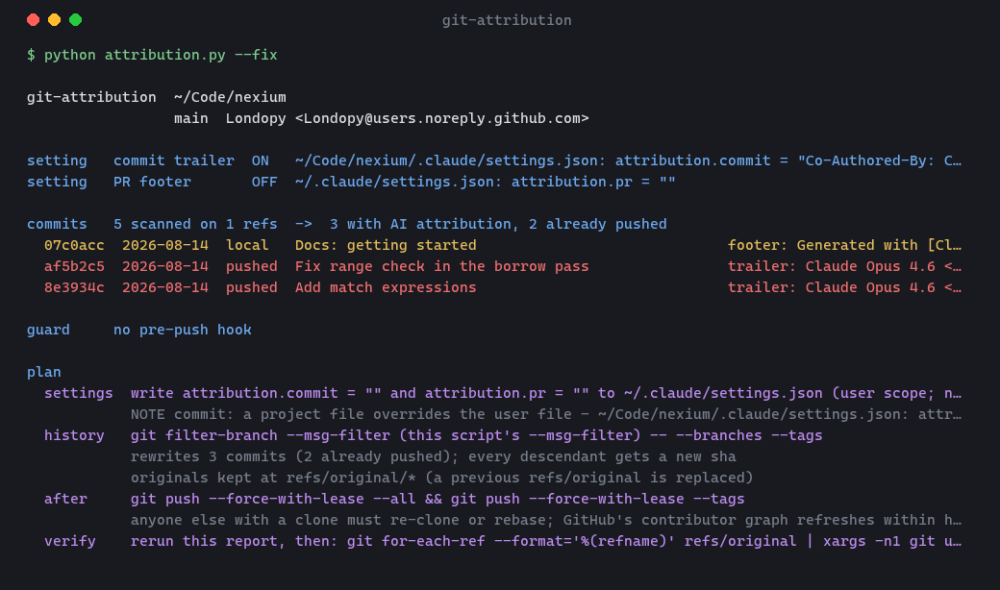

<div align="center">

# Londopy's Claude Code skills

**Tools that make what Claude Code does silently legible — which skills registered, which MCP servers will fail and why, which settings file won, and who signed your commits.**

[](https://github.com/Londopy/claude-skills/actions/workflows/ci.yml)
[](https://github.com/Londopy/claude-skills/actions/workflows/sync.yml)
[](LICENSE)
[](https://www.python.org/)
[](#the-skills)
[](https://code.claude.com/docs/en/plugins)

</div>

---

Claude Code registers skills, starts MCP servers, merges six settings files and signs commits — and tells you nothing about any of it until something's missing. Each skill here rebuilds one of those silent steps from disk, with the reasons attached, then repairs or reports. Every one is a single stdlib-only Python script that also runs as a plain CLI, read-only unless you pass `--apply`, with `--json` and `--strict` for tooling and CI.

This repo is the whole family in one install. Each skill also lives in its own repo, which is the source of truth; the copies here are synced from upstream by [`sync.py`](sync.py), pinned in [`skills.lock.json`](skills.lock.json), and CI fails if they drift.

## The skills

| | Skill | Answers | Repo |
|---|---|---|---|
| <a href="docs/skill-rollcall.png"></a> | **[skill-rollcall](skills/skill-rollcall/SKILL.md)** | Which skills are registered, which are new since the session started, which will *never* register and why. `--lint` for why one doesn't trigger, `--audit` for what to read before running a skill you just installed, `--fix` for the folder moves that repair it. | [Londopy/skill-rollcall](https://github.com/Londopy/skill-rollcall) |
| <a href="docs/mcp-rollcall.png"></a> | **[mcp-rollcall](skills/mcp-rollcall/SKILL.md)** | Which MCP servers will fail to connect and exactly why — missing command, dead path, unset variable, nothing listening on the port — and, with `--probe`, the server's own stderr, tool count and context cost that the harness discards. | [Londopy/mcp-rollcall](https://github.com/Londopy/mcp-rollcall) |
| <a href="docs/settings-effective.png"></a> | **[settings-effective](skills/settings-effective/SKILL.md)** | The merged settings actually in effect, with the file that decided each key; and why the one you set isn't applying — wrong-scope file, shadowed value, `allow` outranked by `ask`, typo, a file skipped for bad JSON. `--explain` any of 231 keys. | [Londopy/settings-effective](https://github.com/Londopy/settings-effective) |
| <a href="docs/git-attribution.png"></a> | **[git-attribution](skills/git-attribution/SKILL.md)** | Is Claude Code still adding `Co-Authored-By` to your commits, which commits already carry it (pushed vs local), a rewrite that strips it with a backup, and a pre-push hook that keeps it out. Knows Copilot, Codex, Cursor, Gemini, Devin and Aider too. | [Londopy/git-attribution](https://github.com/Londopy/git-attribution) |

## Install

**Everything, `skills` CLI** (global; `--copy` because symlinks need Developer Mode on Windows):

```bash
npx skills add Londopy/claude-skills -g --copy
```

**Everything, as one Claude Code plugin** (in an interactive `claude` session):

```
/plugin marketplace add Londopy/claude-skills
/plugin install londopy-skills@claude-skills
```

**One at a time** — the same marketplace lists each skill individually, sourced from its own repo:

```
/plugin install mcp-rollcall@claude-skills
```

**By hand:**

```bash
git clone https://github.com/Londopy/claude-skills
cp -r claude-skills/skills/* ~/.claude/skills/
```

Claude Code watches the skills folder, so they show up without a restart. `/skill-rollcall` confirms it — that's what it's for.

## How the copies stay honest

- `python sync.py` clones each upstream repo at its default branch, copies `skills/<name>/` and its demo image here, and writes the commit and version to `skills.lock.json`.
- `python sync.py --check` exits 1 if any copy differs from upstream. CI runs it on every push.
- A [weekly workflow](.github/workflows/sync.yml) re-syncs and commits any change as the repo owner, so a fix landing upstream reaches this bundle without a manual step.
- Bugs and PRs go to the individual repos. A change made here would be overwritten on the next sync.

## Conventions the family shares

- `skills/<name>/SKILL.md` + one `scripts/<tool>.py`, Python 3.10+, stdlib only.
- Read-only by default; mutation only behind `--fix --apply` (or `--guard --apply`), always after a printed plan.
- `--json` for tooling, `--strict` for CI, `--problems-only` when only findings matter.
- A SKILL.md that says which mode to run from what the user asked, tells Claude to answer the question before summarizing, and ends with what the tool *cannot* do.
- Tests on throwaway fixtures, a 3-OS × 2-Python CI matrix, and a `docs/demo.png` rendered from real output.

## License

MIT, same as each upstream repo.
